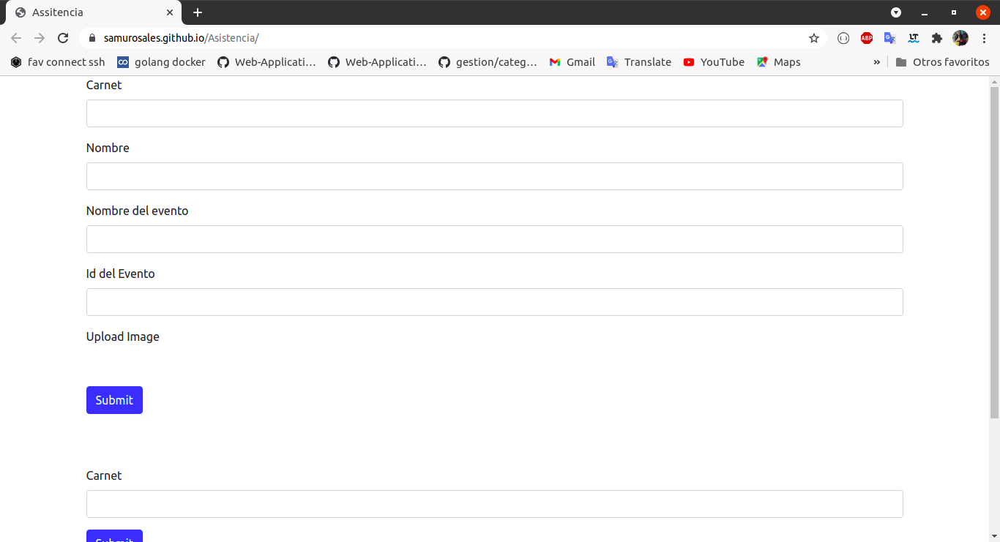

### Manual tecnico:

###### Arquitectura: 

****


###### Tecnologias:

API:

​	Lenguaje: Python

​	Framekork: Flask

​	

Server:

​	Framekork:  Flask

​	Lenguaje: Python


Base de datos:

​	MySQL


###### Docker-compose server

```yaml
version: '3'

services:

  service1:
    build: back/.
    container_name: service1
    volumes:
      - '.:/backend/code'
    environment:
      - SERVNAME=201404104
    ports:
    - 5000:5000
    networks:
      service_network:
    depends_on:
      - database


  database:
    image: mysql:latest
    command: --default-authentication-plugin=mysql_native_password
    container_name: bases-db
    ports:
      - '3306:3306'
    environment:
      MYSQL_ROOT_PASSWORD: 201404104
      MYSQL_DATABASE: nicte
      MYSQL_USER: admin
      MYSQL_PASSWORD: admin
    volumes:
      - database:/var/lib/mysql
    networks:
      service_network:

networks:

    service_network:
        driver: bridge

volumes:
    database:
```

###### Docker file

```dockerfile
FROM python:3.8
ADD . /code
WORKDIR /code
RUN pip install -r requirements.txt
CMD python app.py
```


###### Interfaz de usuario:

url: https://samurosales.github.io/Asistencia/




